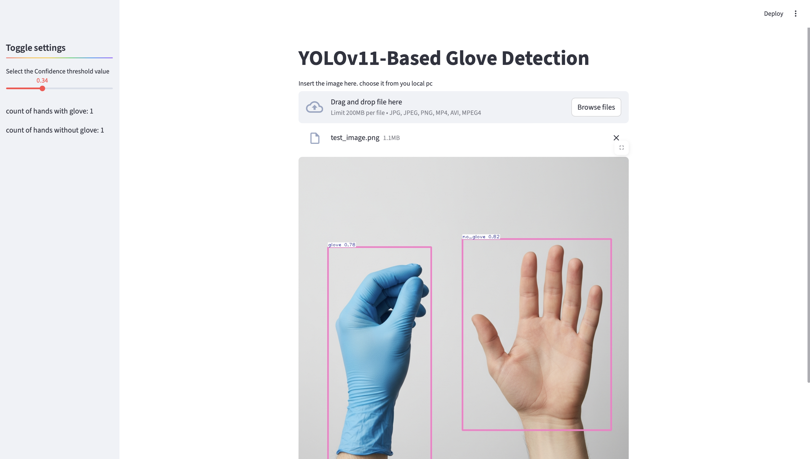

# YOLOv11-Based Glove Detection
A computer vision project built using YOLOv11 and Streamlit to detect whether a person is wearing gloves or not, in both images and videos.

# Dataset
- Name: [Glove Computer Vision Dataset](https://universe.roboflow.com/glove-uylxg/glove-q7czq)
- Source: Roboflow platform
- Total Images: 1,708
- Annotations: YOLOv11 format
- Classes:
  - glove
  - no_glove
- Preprocessing (done by Roboflow):
  - Auto-orientation of pixel data (EXIF stripping)
  - Resized to 640×640
  - No additional image augmentations applied
 
# Model:
- Model Used: YOLOv11-L
- Epochs Trained: 49 (best model saved at epoch 37 due to early stopping)
- Early Stopping Patience: 12
- Training Duration: ~1 hour on Tesla T4 GPU
- Model Download link [click here](https://drive.google.com/uc?id=18IDRlZx4LF4TT07AH48LOL_yA9J3URnz)
- ### Validation Results

    | Metric | Value |
    | --- | --- |
    | **Precision** | 0.985 |
    | **Recall** | 0.989 |
    | **mAP@50** | 0.995 |
    | **mAP@50-95** | 0.759 |

# What Worked:
  - YOLOv11-L provided excellent precision and recall.
  - Streamlit interface enabled smooth, real-time testing.
  - The model performed well even on unseen images, maintaining high confidence levels in predictions for both glove and no-glove categories.
  - Training remained stable across 49 epochs with minimal overfitting, thanks to proper early stopping (patience=12) and learning rate tuning.
  
  
# What didm't work:
  - Limited variation in lighting reduced performance in darker scenes.
  - No augmentations led to slightly lower robustness to real-world noise.
    
# Challenges:
  - Uploading large model weights (51 MB best.pt) to GitHub exceeded file limits.
  - Required external hosting (Google Drive)
  - Video inference is slightly slower due to frame-by-frame processing.

# How to run:
1. Clone this repository:
   ```bash
   git clone https://github.com/vin-08/glove-detection-yolov11.git  
   cd glove-detection-yolov11
   ```
2. Create and activate a virtual environment:
   ```bash
   python -m venv venv
   source venv/bin/activate        # for macOS/Linux
   venv\Scripts\activate           # for Windows
   ```
3. Install dependencies:
   ```bash
   pip install -r requirements.txt
   ```
4. Run the Streamlit app:
   ```bash
   Run the Streamlit app
   ```
5. The app will automatically download the YOLOv11 model (best.pt) from Google Drive and load it.
   - You don’t need to manually download or provide the model path — it’s handled in the code.
   - Once loaded, upload an image/video to test glove detection.
  

